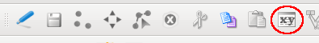
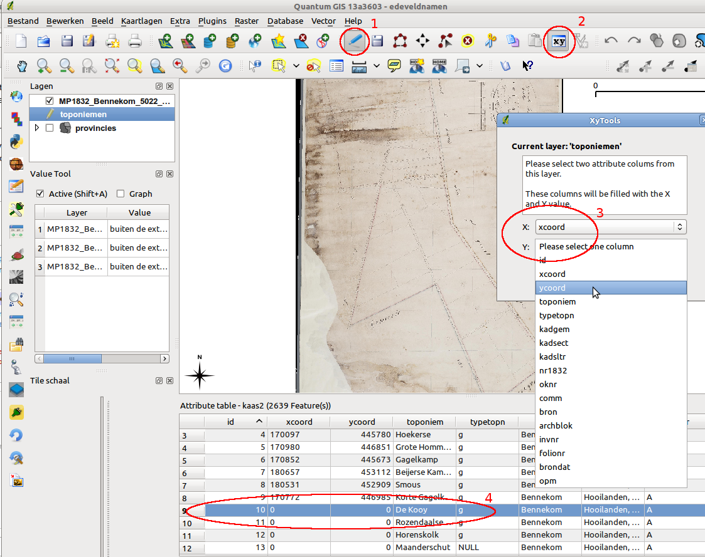
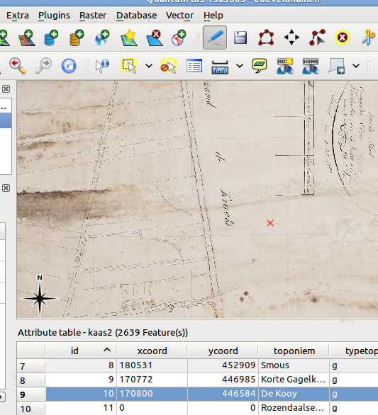
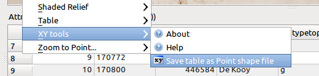

XY Tools plugin
===============

Aim
---

The aim of the xy-tools-plugin is to fill an x- and y-column
of a given attribute table by clicking on a (reference) map.

After 'filling the x and y column' you are able to export the table to a point shape file.

It started off as a plugin for a user who had an excell file with
toponiemen / fieldnames and a stack of old scanned cadastral maps.

Use
---

If you have installed the xytools plugins, you should see a new button in the edit/digitize toolbar (see red circle in image)

Start by 'toggle edit' of a given layer (1).

When the layer is a vector layer, the xytool-button will be activated (2).

When checked a dialog pops up (3) where you will have to choose the
x and y columns.

Before clicking in the map: open the attribute table and make one feature/record active (4).

You can now click in the map to fill the designated x and y fields of the selected record. 

When selecting a record in the attribute table a red cross is shown on those x,y coordinates

The tool behaves as a normal digitize tool. By toggling editing again you will be asked to either
save your edits, or discard them.

In the menu of xy tools there is the possibility to save a attribute table as a point shape file (img below).

Geometries of the shape file will be using the x- and y- columns for there coordinates.

Notes
-----

Currently the plugin is working both with shape files and single dbf-files. Saving cvs files is not supported by
the underlying OGR-library.

So: for a dbf you can add and remove records. But if you want further editing: like inserting records, adding columns etc,
either use Libre/Open-office, or one of the other qgis table plugins.

Ideas/todo
----------
- instead of saving as shape: make it a memory layer, giving it the possibility to use the generic 'save as'-whatever dialog.

- reproject / change srs of a table containing x and y colum

- selecting a record of a single dbf raises errors in command box

And
---

If you find bugs or have ideas for this plugin, contact Richard Duivenvoorde ( richard@duif.net ).
